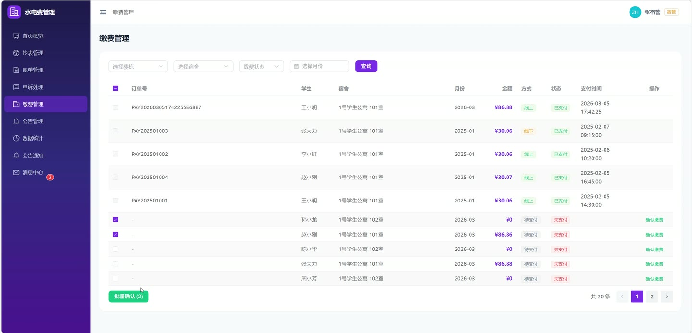
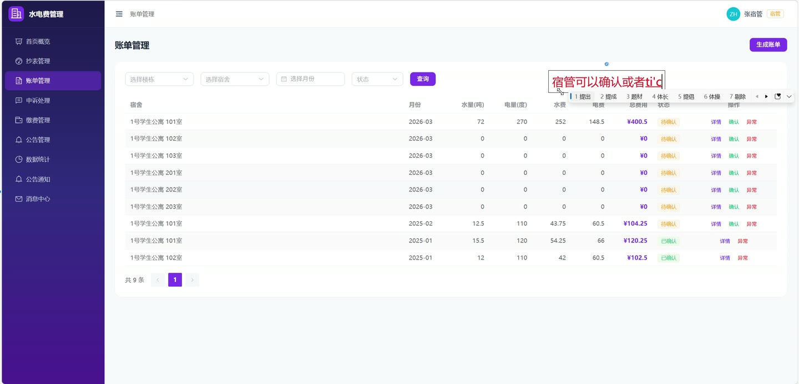
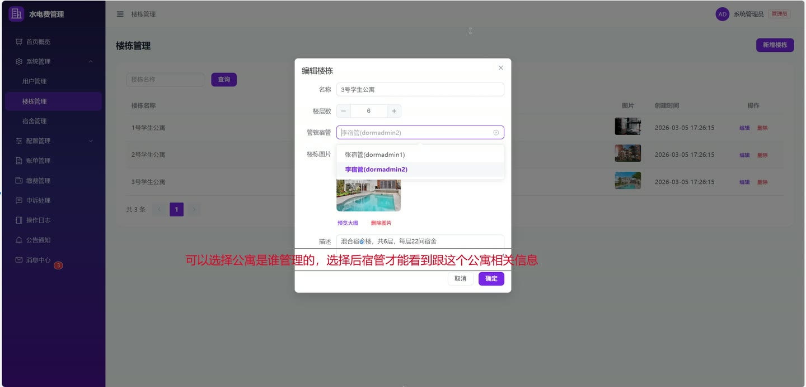
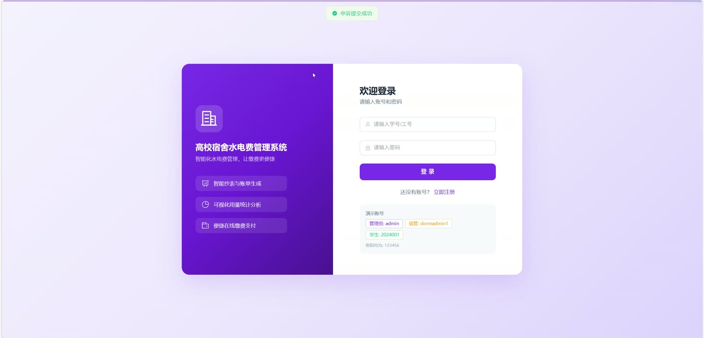
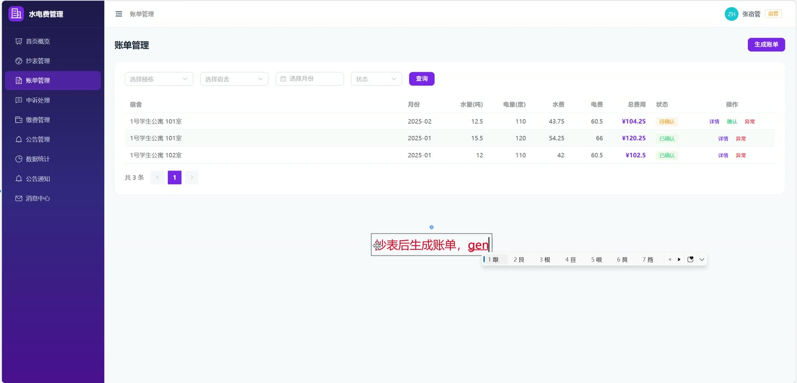

# (附文档)Springboot3+Vue3 高校宿舍水电费管理系统

**技术栈**：Springboot3、Vue3

### 系统简介

本系统为基于 SpringBoot3 + Vue3 前后端分离架构的高校宿舍水电费管理系统，包含学生、宿管、系统管理员三种角色。系统围绕宿舍水电费管理全流程设计，涵盖水电表管理、抄表录入、月度账单自动生成与分摊、学生在线缴费与申诉、公告通知发布、站内消息推送等核心业务模块，实现从数据采集到费用结算的闭环管理。
 
### 核心功能
 
### 学生端

 
- 查看个人分摊记录列表，支持按月份、确认状态筛选，确认分摊费用无误 
- 在线模拟支付水电费，选择分摊记录后生成支付订单，支付后自动确认分摊 
- 查看个人支付订单列表，支持按支付状态、月份筛选，获取缴费凭证 
- 提交水电费申诉，填写申诉类型、关联账单、申诉内容，提交后通知宿管 
- 查看申诉处理结果，在"我的申诉"列表中查看状态和回复 
- 查看所在楼栋的公告通知，支持按类型筛选，仅显示已发布公告 
- 查看站内消息列表，支持按类型筛选，标记单条或全部消息为已读 
- 查看当前宿舍信息和宿舍历史账单（最近12个月） 
- 修改个人资料（姓名、手机号等）和登录密码（需验证旧密码） 
- 学生注册功能，注册后默认角色为学生
 
### 宿管端

 
- 管理管辖楼栋下的水电表，支持新增、修改、删除水表或电表 
- 录入单条抄表数据（填写当前读数、月份），系统自动计算用量 
- 批量录入抄表数据，一次性录入多条抄表记录，提高工作效率 
- 分页查询抄表记录，支持按楼栋、宿舍、月份、表类型筛选 
- 查看管辖楼栋的账单列表，支持按宿舍、月份、状态筛选 
- 确认账单（PENDING→CONFIRMED）或标记账单异常（PENDING→ABNORMAL） 
- 修改账单信息（用量、单价等），系统自动重新计算费用 
- 查看管辖楼栋的支付订单，支持按学生、宿舍、状态、月份筛选 
- 确认学生线下缴费，支持单条确认和批量确认 
- 通过分摊记录ID确认线下缴费，为未支付学生创建线下支付记录 
- 发布、修改、上架/下架、删除公告，支持指定楼栋或全校发布 
- 查看自己发布的公告列表，管理公告的可见性 
- 查看管辖楼栋的申诉列表，处理申诉（通过/驳回） 
- 查看仪表盘统计（管辖楼栋数、待处理申诉数）
 
### 系统管理员端

 
- 管理所有楼栋，支持新增、修改、删除楼栋信息 
- 管理宿舍，支持新增、修改、删除宿舍，绑定/解绑学生 
- 管理所有用户，支持分页查询、修改用户信息、删除用户 
- 修改用户状态（启用/禁用），重置用户密码为123456 
- 新增宿管账号，创建宿管角色用户 
- 配置水电单价（水、电单价），查看当前有效单价和历史配置 
- 生成月度账单，选择楼栋和月份，系统自动读取抄表数据计算费用并分摊 
- 查看所有账单，处理异常账单（修正用量、重新计算费用和分摊） 
- 查看所有支付订单，支持多条件筛选，处理异常订单 
- 查看所有申诉，处理申诉（通过/驳回） 
- 查看系统操作日志，支持按用户名、操作类型筛选 
- 查看仪表盘统计（用户总数、学生总数、楼栋数、宿舍数、待处理申诉数、待确认账单数、未支付订单数）
 
### 技术栈

  后端框架 Spring Boot 3.x   ORM MyBatis-Plus   权限认证 JWT（JSON Web Token）   前端框架 Vue 3   状态管理 Pinia   前端路由 Vue Router   构建工具 Vite   数据库 MySQL 
 
### 交付内容

 
- 后端完整源码 
- 前端完整源码 
- 数据库初始化脚本 
- 万字文档

## 界面展示

---

## 获取完整源码 + 万字文档

本仓库为项目介绍页。**完整前后端源码、数据库初始化脚本、万字项目文档**，请加微信 `kangkangcode`，或访问 [codekk.top](http://codekk.top) 获取。

可作课程设计 / 毕业设计参考，支持远程部署调试。